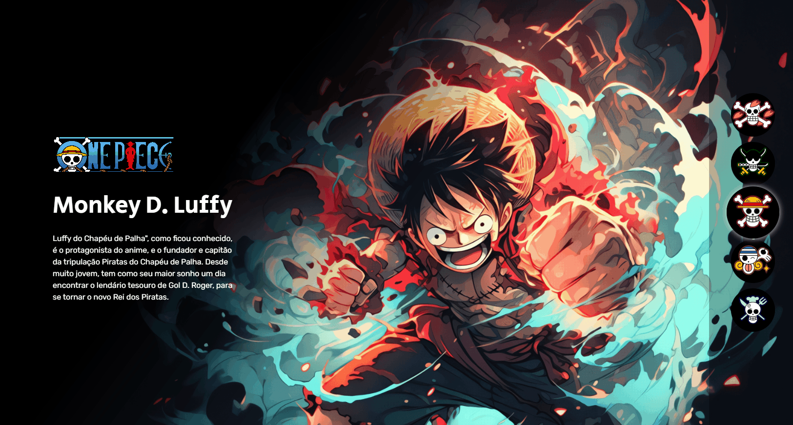
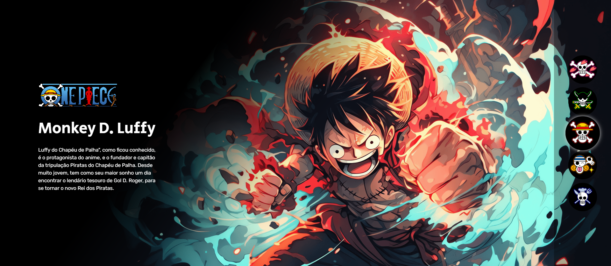

# ⚓ Projeto-One-Piece ⚓

### 📜 Descrição:

Projeto de uma página bem intuitiva, usando botões a direita para navegar pelos personagens, cada botão leva para um personagem com sua descrição e imagem. Iniciei o projeto para práticar as tecnologias que venho aprendendo no Curso de Frontend.

### 🚀 Tecnologias Utilizadas:

    
    
    

### 📸 Screenshot:

